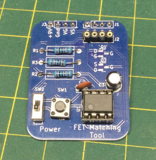

# FET_Matching
N Channel JFET Matching PCB 
Used with a multimeter to read VGS on a JFET so that it acts like a 10K resistor. 
eg.  Some JFETs may look like a 10K resistor when VGS = -1.5v 
while others look like a 10K resistor when VGS = -0.350v 
FETs can be measured and sorted in groups with similar VGS specs when needed.
    
